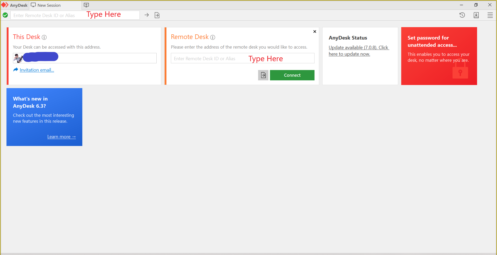

========================
Phoniex
========================

..
    Line Blocks

    empty line before/after
    unorder/bullet list : * - + 
    numbered : #. / 1.
    indented : seprate by a blank line

    To include content such as code or an image inside a list, position the 
    code or image directive flush with the text in the list. That is, indent 
    three spaces for ordered lists and two spaces for unordered lists.

    Definition Lists

How to Connect
==============

1. Download OpenVPN
2. Open ``OpenVPN GUI``
#. Make sure that you have ovpn config file
#. Import config file *file with ovpn extension*
#. In The System Tray 
   right click on ``OpenVPN GUI`` and the **Connect**

OpenVPN
    virtual private network system that implements techniques to create 
    secure point-to-point or site-to-site connections in routed or bridged 
    configurations and remote access facilities. It implements both 
    client and server applications.

..
    Directives
    +-------+-------------------------------+
    | ".. " | directive type "::" directive |
    +-------+ block                         |
            |                               |
            +-------------------------------+
    arguments, options (a field list), and content
    "attention", "caution", "danger", "error", "hint", "important", "note", 
    "tip", "warning", "admonition"

.. danger::
    Private Network IP-Range
        - Class A: 10.0.0.0 — 10.255.255.255
        - Class B: 172.16.0.0 — 172.31.255.255 
        - Class C: 192.168.0.0 — 192.168.255.255 

.. tip::
    you can use *Anydesk* if you don't want to connect to **VPN**

.. caution::
    connecting more that one device to the **VPN** results in higher latency

.. note::
    you have high latency --> go with **Anydesk**

Connecting with Anydesk
========================

You should write remote computer's ID in the specified location `in the picture <#anydesk-1>`_
or you can use think :ref:`link1 <anydesk 3>` or `this2 <#anydesk-2>`_ or 
`any desk 4`_

.. _`any desk 4`: #anydesk-2

.. _anydesk 3:

    Here you should type target ID

..
    See the Python_ home page for info.

    `Write to me`_ with your questions.

    .. _Python: https://www.python.org
    .. _Write to me: jdoe@example.COM

.. code-block:: python
    :emphasize-lines: 3,5
    :caption: Python Code Block

    print("Hi, I'm a code block1")
    print("Hi, I'm a code block2")
    print("Hi, I'm a code block3")
    print("Hi, I'm a code block4")
    print("Hi, I'm a code block5")

.. literalinclude:: file.py
    :language: python
    :lines: 1-2, 4-5
    :linenos:

.. hint::
    `Lexer <https://pygments.org/docs/lexers/>`_