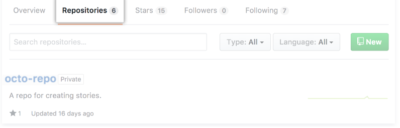
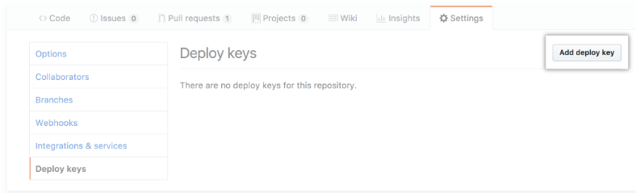
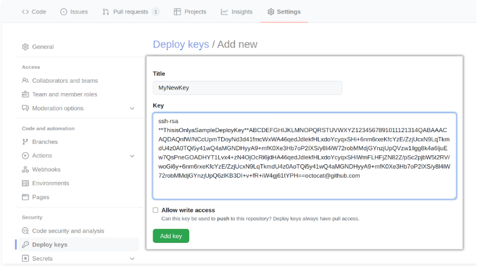

Manage deploy key
====================

1. Copy the public ssh key to clip board.

.. code-block:: bash

    clip < ~/.ssh/id_ed25519.pub

2. On your profile page in github, click Repositories, then click
   the name of your repository.

3. From repo click Settings

4. In the sidebar, click Deploy Keys, then click Add deploy key.

5. Provide a titel, paste in your public key.

6. Select Allow write access if you want this key to have write
   access to the repository. A deploy key with write access lets 
   a deployment push to the repository.

7. Click Add key.

=================
Reference Links
=================
- **Sources**
- `managing deploy keys <https://docs.github.com/en/developers/overview/managing-deploy-keys>`_
