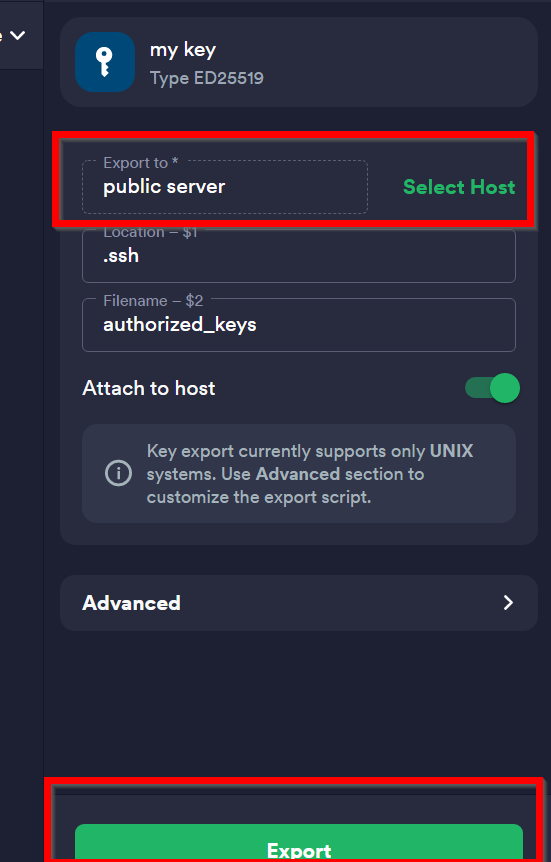

Add key in Termius 
=====================

inorder to add or generate an ssh key depends on your condition follow the bellow instructio :

**Generate key**

1. in Preferences, choose Keychain.

2. Click + New Key and then Generate new key.

3. Specify key parameters. Add a passphrase, if desired, and check Save passphrase to 
   save the passphrase in the key entry that you are creating.
   Click Generate & save.

in addition you could import a key by pasting the private and public parts in Specific part "import key" in step 2.

**export key**
Exporting keys means adding its public part to the authorized_keys file,
which is stored on the server. On iOS and Android, the key will be automatically attached to that host's entry.

1. In Preferences, choose Keychain.
2. Right-click the key and then Export to host.

3. Click Select host and select the host to which you want to upload the key.

1. Check Attach to host, if you'd like the key to be linked with the host you've selected.
2. Adjust other parameters, if desired.
3. Tap the required host and then Export.
4. Click Export key at the top.

**Source**

`- Termius docs <https://support.termius.com/hc/en-us/articles/4401872025113-Keychain#:~:text=Import%20a%20key,Import%20or%20paste%20a%20key.>`_

