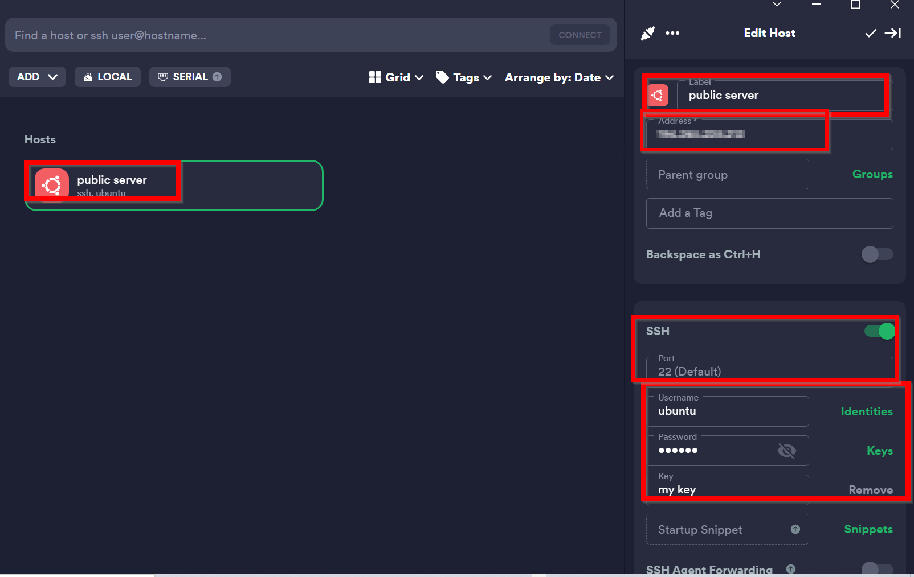

How to create new host in Termius 
===================================

create a new host in Termius :

1. in Specific part type the ip of your host

2. Right-click on the host and edit the Specific parts which are squred.

.. note::

    port 22 is pereferd for ssh conncetion so do not change it.

3. Now you are ready to connect to your host . 

4. now you are there.

.. image:: termius/create-host/there.png
    :alt: host connected
    :name: Final step

