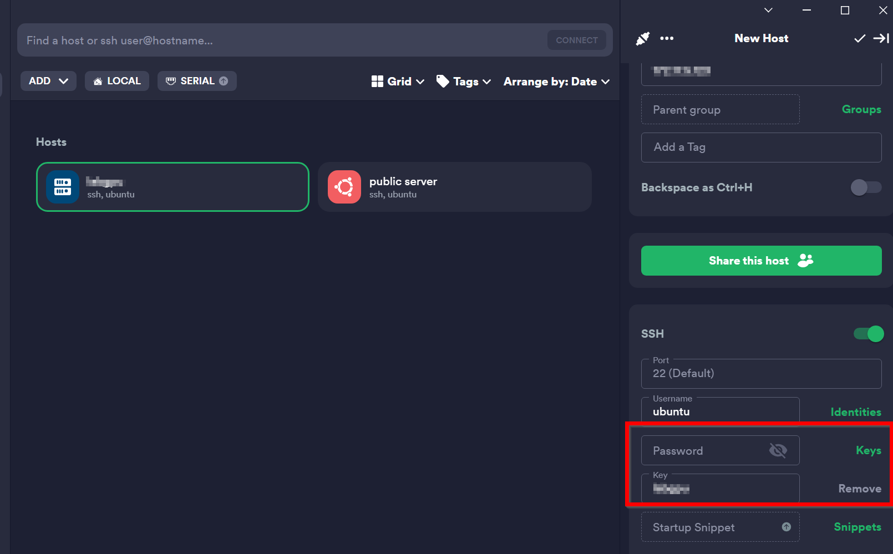
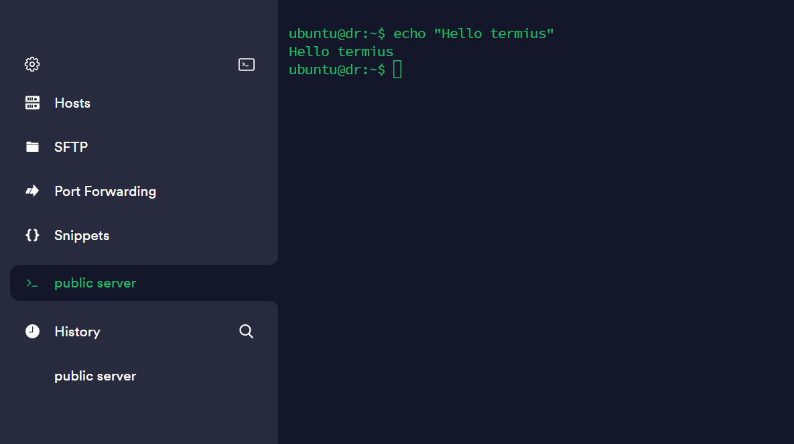

How to login with private key 
===============================

Step1. first you need to add a new host which is explained in `create host Section <https://deploy-documentation.readthedocs.io/en/latest/Termius/create-host.html>`_ .
---------------------------------------------------------------------------------------------------------------------------------------------------------------------------

every things are the same but this time you are going to 
ssh to host with your own private key not by password which is 
more secure now.

This time leave the password section blank ,but on the right select “Keys”. Here you can select
your private SSH key which is stored on your device and we mentioned in `add key section <https://deploy-documentation.readthedocs.io/en/latest/Termius/add-key.html>`_ .

.. note::

    the public key counterpart is what's added to your server.

make sure to save the changes .

---------------------------------

Step2. Connect your host .
----------------------------

you will be able to succusefully ssh to your host.

